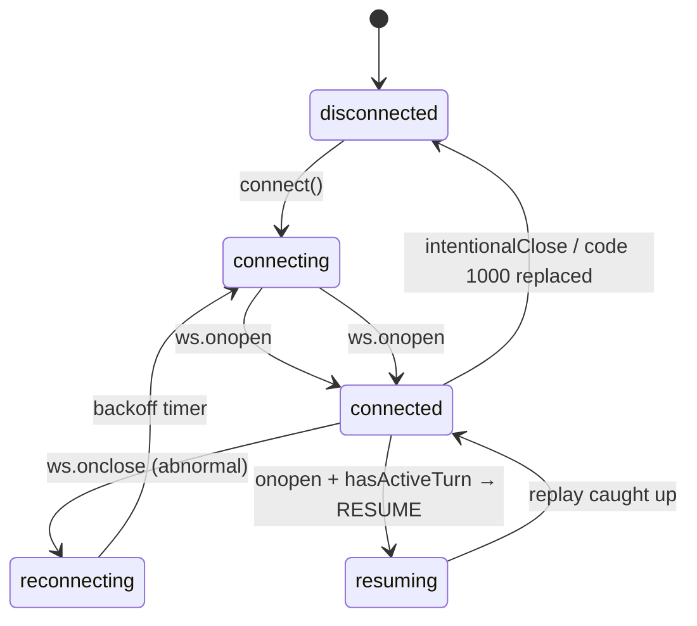
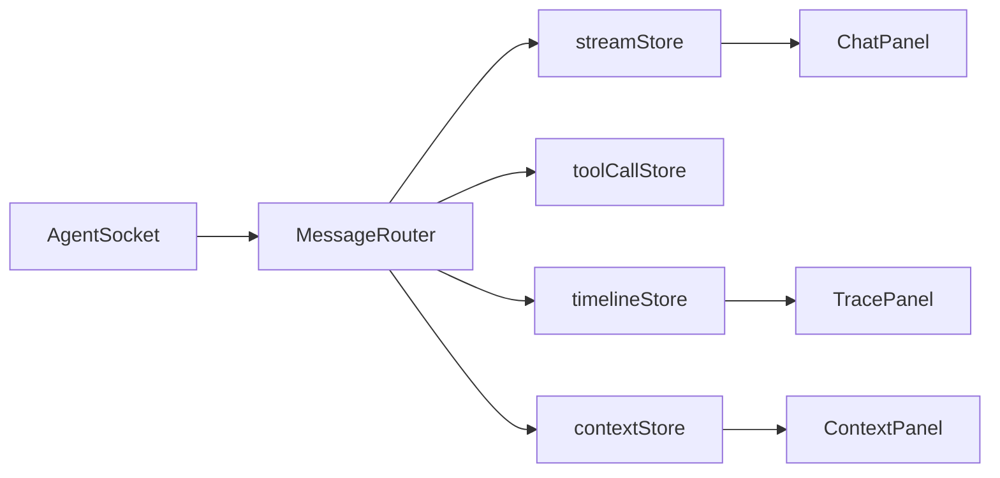

# Agent Console

A Next.js application that connects to the Alchemyst mock agent-server over WebSockets, streams token responses with mid-stream tool call interruptions, displays a live agent trace timeline, inspects context snapshots with diffs, and survives chaos mode through protocol-level reordering, deduplication, and reconnection recovery.

**Architecture:** `AgentSocket` handles transport + heartbeat + reconnect; `MessageRouter` owns seq ordering/dedup; Zustand stores hold chat streams, tools, timeline, and context; React components render the three panels.

## Quick Start (for reviewers)

**Use the production path** — this is what the assignment requires and avoids dev-cache issues:

```bash
# Terminal 1 — agent server
cd ../agent-server
docker build -t agent-server .
docker run -p 4747:4747 agent-server

# Terminal 2 — console
npm install
npm run verify          # clean + typecheck + test + production build
npm run start           # serves on http://localhost:3000
```

One-liner after install: `npm run build && npm run start`

### Local development

```bash
npm run dev             # auto-clears .next if a production build is detected
npm run dev:clean       # force clean cache, then dev (use if you see chunk errors)
```

**Do not** run `npm run dev` and `npm run start` at the same time — they share `.next/` and will corrupt each other.

### Troubleshooting: `Cannot find module './229.js'`

This means the `.next` cache is stale (usually from mixing `next dev` and `next build`):

```bash
npm run clean
npm run build && npm run start   # production
# or
npm run dev:clean                # development
```

Hard-refresh the browser (`Ctrl+Shift+R`) after restarting the server.

### Chaos mode

```bash
docker run -p 4747:4747 agent-server --mode chaos
```

Record a 3–5 minute screen capture demonstrating the five chaos scenarios (see [docs/chaos-recording.md](./docs/chaos-recording.md)).

### Production build

```bash
npm run build    # automatically runs clean first (prebuild)
npm run start
```

`npm run verify` runs the full reviewer checklist: clean → typecheck → test → build.

## Connection State Machine



## Message Pipeline



## Screenshots

Capture these in normal mode after sending a message that triggers tools and context:

| Screenshot | Path | Description |
|------------|------|-------------|
| Chat + tool call | `docs/screenshots/01-chat-tool-call.png` | Streamed response with tool card |
| Trace timeline | `docs/screenshots/02-trace-timeline.png` | Agent trace panel with grouped tokens |
| Context diff | `docs/screenshots/03-context-diff.png` | Context inspector with diff highlights |

> **Note:** Add PNG files to `docs/screenshots/` before final submission. See `docs/screenshots/README.md`.

## Project Structure

```
agent-console/
├── app/                    # Next.js App Router
├── components/
│   ├── chat/               # Chat, tool cards, input
│   ├── timeline/           # Trace panel
│   └── context/            # Context inspector + JSON tree
├── lib/
│   ├── agent/              # AgentSocket, MessageRouter
│   ├── protocol/           # Types + constants
│   ├── stores/             # Zustand stores
│   └── utils/              # reorderBuffer, contextDiff
├── providers/              # AgentProvider wiring
└── tests/
```

## Protocol Compliance

Verified via `GET http://localhost:4747/log`:

- `USER_MESSAGE` on send
- `PONG` within 3s of `PING`
- `TOOL_ACK` within 2s of `TOOL_CALL`
- `RESUME` with `last_seq` on reconnect during active turn

## License

Assignment submission — Alchemyst AI.
